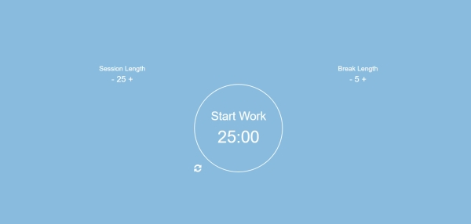

# Pomodoro Clock

Simple countdown timer to help you pace your work sessions and your breaks. 25 minutes of work followed by a 5-minute break. Such is the [Pomodoro Technique](https://en.wikipedia.org/wiki/Pomodoro_Technique)!

You can start or stop the clock as you like, as well as modify the length of your work sessions and your breaks. The messages on the clock help you remember where in the cycle you're supposed to be.

This was my first project using SASS, and I haven't looked back since. 

